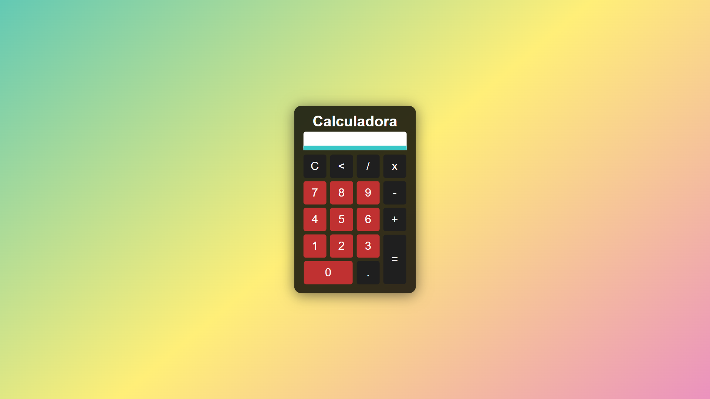

<h1 align="center"> Projeto Social </h1>

O Projeto Calculadora é um projeto criado para testar meus conhecimentos com lógica de programação e JavaScript. 
<a href="https://github.com/weslleyrichardi/Projeto-Calculadora">Estude esse projeto em formato de vídeo clicando aqui.</a>

  <a href="#-tecnologias">Tecnologias</a>&nbsp;&nbsp;&nbsp;|&nbsp;&nbsp;&nbsp;
  <a href="#-projeto">Projeto</a>&nbsp;&nbsp;&nbsp;|&nbsp;&nbsp;&nbsp;
  <a href="#-layout">Layout</a>&nbsp;&nbsp;&nbsp;|&nbsp;&nbsp;&nbsp;
  <a href="#memo-licença">Licença</a>

  

 

  

## 🚀 Tecnologias

Esse projeto foi desenvolvido com as seguintes tecnologias:

- HTML e CSS
- JavaScript
- Git e Github

## 💻 Projeto

O projeto foi criado para testar meus conhecimentos com lógica de programação e JavaScript.

- [Acesse o projeto finalizado, online](https://weslleyrichardi.github.io/Projeto-Calculadora/)
  
## :memo: Licença

Esse projeto está sob a licença MIT.
